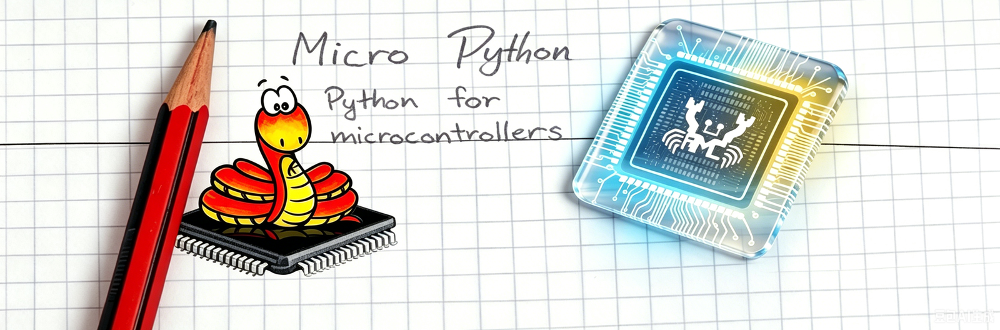

<div align="center">



# MicroPython for Ameba-RTOS

**Write Wi-Fi, networking, filesystem and peripheral applications in Python directly on Realtek Ameba chips.**

[](https://micropython.org)
[](#-supported-hardware)
[](https://www.freertos.org)
[](LICENSE)
[](#-roadmap)

[English](README.md) · [中文](README_CN.md) · [Roadmap](#-roadmap) · [SDK User Guide](https://aiot.realmcu.com/en/latest/rtos/sdk/index.html)

</div>

This is a port of the [MicroPython](https://micropython.org) project to the
[Realtek Ameba-RTOS](https://github.com/Ameba-AIoT) SDK.  The port lives in
`ports/ameba-rtos-m/` and lets you write Wi-Fi, networking, filesystem and
peripheral applications in Python directly on Ameba chips — connect over
serial and get an interactive REPL, no firmware recompilation needed.

The primary target is the **AmebaDplus (RTL8721Dx)**. **AmebaGreen2
(RTL8721F/RTL8711F)** is also actively being ported (see the EV8711FLM
board), with AmebaLite and AmebaSmart to follow via `soc_info.json`
switching.

This is an active development port; some `machine` peripheral modules are
still in progress.  See the [Roadmap](#-roadmap) for current status.

## 🚀 Getting started

See the [online documentation](https://docs.micropython.org/) for the
MicroPython API reference and general usage information.

### Prerequisites

- A Linux host (native or WSL2).
- `git` and Python 3.8+.
- `source ameba-rtos/env.sh` provisions the cross-toolchain and a Python
  virtualenv on first use — it downloads prebuilts from GitHub (or the Aliyun
  mirror), so the first run needs network; later runs reuse them.

### Get the source

```bash
git clone <repo-url> MicroPython
cd MicroPython
```

### Build (recommended)

A top-level `Makefile` delegates to the port-level Makefile, which handles
board selection, toolchain environment and packaging:

```bash
make                                    # incremental build (default: BOARD=PKE8721DAF)
make BOARD=PKE8721DAF                   # explicit board selection
make pristine                           # full (pristine) build
make clean                              # clean
make deploy PORT=/dev/ttyUSB0           # flash (skips build; run make first)
make build deploy PORT=/dev/ttyUSB0     # build, then flash
```

Submodules must be initialised once before the first build (see below).

### Build (manual)

If you prefer to run the steps yourself:

```bash
# One-time: initialise submodules needed for the build
git submodule update --init micropython ameba-rtos
cd micropython
git submodule update --init lib/berkeley-db-1.xx lib/micropython-lib
cd ..

# Each shell session: initialise the toolchain, then build
source ameba-rtos/env.sh
cd ports/ameba-rtos-m
make BOARD=PKE8721DAF           # incremental build
make BOARD=PKE8721DAF pristine  # full build
```

Either way you should see **`Build done`** when the build succeeds.  The
`mpy-cross` bytecode compiler is built automatically on the first run.

> [!TIP]
> For detailed toolchain setup, build and flashing, see the
> [Ameba-RTOS SDK User Guide](https://aiot.realmcu.com/en/latest/rtos/sdk/index.html).

### Flash and run

The build writes the firmware images to
`ports/ameba-rtos-m/build_PKE8721DAF/` (`boot.bin`, `app.bin`, `firmware.bin`).
The quickest path is `make deploy`, which flashes without rebuilding — fast
for repeated deploys (the `PORT` is required; it retries automatically on
transient flash errors, and `BAUD=` overrides the rate):

```bash
make deploy PORT=/dev/ttyUSB0                        # flash only (skips build)
make build deploy PORT=/dev/ttyUSB0                  # build, then flash
make build deploy PORT=/dev/ttyUSB0 BAUD=115200
make BOARD=PKE8721DAF deploy PORT=/dev/ttyUSB0       # explicit board
```

Or flash an existing build manually (run `ameba.py flash -h` for options such
as `-b <baud>` and `--chip-erase`):

```bash
cd ports/ameba-rtos-m
python ../../ameba-rtos/ameba.py flash -p /dev/ttyUSB0 -dev RTL8721Dx
```

#### Flashing a pre-built release (no SDK required)

- **[AmebaFlash](https://aiot.realmcu.com/download/latest/Tools/AmebaFlash.zip)**
  (CLI, cross-platform)
- **[Image Tool](https://aiot.realmcu.com/download/latest/Tools/ImageTool.zip)**
  (GUI, Windows)

When flashing a release firmware, use start address `0x08000000`.

Then connect over LOGUART with any serial terminal:

```bash
picocom -b 115200 /dev/ttyACM0
```

> [!IMPORTANT]
> LOGUART runs at **115200 baud** by default — set your terminal to match.
> Change `MICROPY_HW_LOGUART_BAUDRATE` in `src/mpconfigport.h` to use another
> rate (e.g. `1500000`).

Once connected you can use the REPL:

```python
>>> import network
>>> wlan = network.WLAN(network.STA_IF)
>>> wlan.active(True)
>>> wlan.connect("your-ssid", "your-password")
>>> wlan.isconnected()
True
>>> wlan.ifconfig()
('192.168.1.123', '255.255.255.0', '192.168.1.1', '8.8.8.8')
```

## ✨ Features

- Full MicroPython REPL over LOGUART serial, with soft reset and paste mode
- Wi-Fi networking: `network.WLAN` STA and AP modes, with scan, connect,
  ifconfig, and status methods
- BSD sockets over lwIP: TCP/UDP with blocking, non-blocking, timeout, and
  SSL support
- Flash filesystem: `ameba.Flash` block device with a littlefs (LFS2) VFS,
  persistent `boot.py` and `main.py` across power cycles
- Frozen modules: `bundle-networking`, `umqtt`, `dht`, `neopixel` and more
  pre-compiled into the firmware
- Multi-threading: `_thread` module backed by FreeRTOS tasks
- `machine` peripheral APIs: `Pin`, `UART` (with IRQ / sendbreak),
  `SPI`, `SoftSPI`, `I2C`, `SoftI2C`, `I2CTarget`, `ADC`, `PWM`, `RTC`,
  `WDT`, `Timer`, `I2S`, `bitstream` (WS2812/NeoPixel, hardware-accelerated
  via the LEDC peripheral with DMA), `lightsleep`, `deepsleep`,
  `wake_reason`, `bootloader`
- `os.dupterm` for WebREPL and multi-console REPL
- `hashlib` (SHA256/SHA1/MD5), `cryptolib` (AES), `onewire`, `dht`
- OTA firmware update: `ameba.Partition` / `ameba.OTA`

## 🔌 Supported hardware

| SoC                                    | Status        |
|----------------------------------------|---------------|
| AmebaDplus (RTL8721Dx)                 | Active        |
| AmebaGreen2 (RTL8721F / RTL8711F)      | In progress   |
| AmebaLite (RTL8720E / RTL8710E)        | Planned       |
| AmebaSmart (RTL8730E)                  | Planned       |

## 🏗️ Architecture

The port is compiled as an `ameba_add_internal_library(micropython)` component
within the ameba-rtos CMake framework.  The entry point is `app_example()` in
`mp_main.c`, which creates a FreeRTOS task that runs `mp_main()`.

Startup flow:

```text
app_example() --> FreeRTOS task --> mp_main() --> _boot.py --> boot.py --> main.py --> REPL
```

A soft reset re-initialises the GC heap and interpreter via `goto soft_reset`
without restarting the RTOS task.

Repository structure:

```text
MicroPython/
├── ports/
│   └── ameba-rtos-m/          # Port directory (active work area)
│       ├── src/               # Port C sources
│       │   ├── mp_main.c      #   Entry: app_example() -> mp_main() -> REPL
│       │   ├── mphalport.c    #   UART HAL (stdin_ringbuf / LOGUART)
│       │   ├── mpthreadport.c #   _thread -> FreeRTOS task
│       │   ├── network_wlan.c #   network.WLAN (Ameba Wi-Fi API)
│       │   ├── modsocket.c    #   BSD socket (lwIP)
│       │   ├── ameba_flash.c  #   ameba.Flash (VFS block device)
│       │   ├── modmachine.c   #   machine module
│       │   └── mpconfigport.h #   Feature flags / heap size
│       ├── boards/manifest.py #   Frozen module list
│       └── modules/_boot.py   #   Startup script (frozen)
├── micropython/               # MicroPython upstream (submodule, read-only)
└── ameba-rtos/                # Realtek Ameba-RTOS SDK (submodule, read-only)
    ├── ameba.py               #   Unified build CLI entry point
    └── env.sh                 #   Toolchain environment init
```

Key port files:

| File               | Role                                      |
|--------------------|-------------------------------------------|
| `mpconfigport.h`   | All MicroPython feature flags; heap size  |
| `mphalport.c`      | UART I/O via `stdin_ringbuf`, `LOGUART`   |
| `mpthreadport.c`   | Thread support via FreeRTOS tasks         |
| `modameba.c`       | The `ameba` Python module (Flash access)  |
| `modsocket.c`      | BSD socket API                            |
| `network_wlan.c`   | `network.WLAN` STA/AP (Ameba Wi-Fi API)   |

## 🗺️ Roadmap

Phases are listed in implementation order (the `Phase` number is a stable
identifier, not the sequence).

| Phase | Content                                                        | PKE8721DAF              | EV8711FLM               |
|:-----:|-----------------------------------------------------------------|:-----------------------:|:-----------------------:|
| 0     | Code audit (API residue scan, QSTR completeness)               | Done                    | Done                    |
| 1     | `network` — Wi-Fi STA / AP / scan                              | Done                    | Done                    |
| 1.5   | Flash FS layout fix (`ameba.Flash` + VFS)                      | Done                    | Done                    |
| 2     | `machine` — `unique_id()` / `reset_cause()`                    | Done                    | Done                    |
| 3     | `machine.Pin` (digital read/write + IRQ)                       | Done                    | Done                    |
| 4     | `machine.UART` (+ IRQ / sendbreak)                              | Done                    | Done                    |
| 5     | `machine.SPI` / `SoftSPI`                                      | Done                    | Done                    |
| 6     | `machine.I2C` / `SoftI2C`                                      | Done                    | Done                    |
| 7     | `machine.ADC`                                                  | Done                    | Done                    |
| 8     | `machine.PWM`                                                  | Done                    | Done                    |
| 9     | `machine.Timer`                                                | Done                    | Done                    |
| 10    | `machine.RTC` (+ `alarm` / `irq`)                              | Done                    | Done                    |
| 11    | `machine.WDT`                                                  | Done                    | Done                    |
| 13    | `machine.I2S`                                                  | Done                    | Done                    |
| 14    | `machine.SDCard`                                               | N/A (no SD host controller) | Done                |
| 16    | `ameba.Partition` / OTA                                        | Done                    | Done                    |
| 20    | `machine.lightsleep` / `deepsleep` / `wake_reason`             | Done                    | Done                    |
| 21    | `time_pulse_us`                                                | Done                    | Done                    |
| 22    | `machine.bitstream` (WS2812/NeoPixel), LEDC hardware DMA backend | Done                  | Done                    |
| 27    | `machine.bootloader()`                                         | Done                    | Done                    |
| 28    | `os.dupterm` / WebREPL                                         | Done                    | Done                    |
| 31    | `machine.I2CTarget` (I2C slave)                                 | Done                    | Done                    |
| 33    | `machine.CAN`                                                  | N/A (no CAN controller) | Done                    |
| 34    | `network.LAN` (Ethernet)                                       | N/A (no RMII MAC)       | Done                    |
| 15    | USB CDC REPL                                                   | Planned                 | Planned                 |
| 12    | Bluetooth BLE (GAP / GATT)                                     | Planned                 | Planned                 |

*Done* means implementation merged and verified on that board's hardware.
*N/A* means the SoC does not have the required hardware for that feature.
